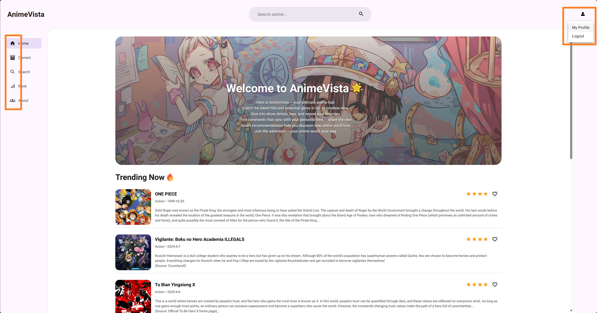
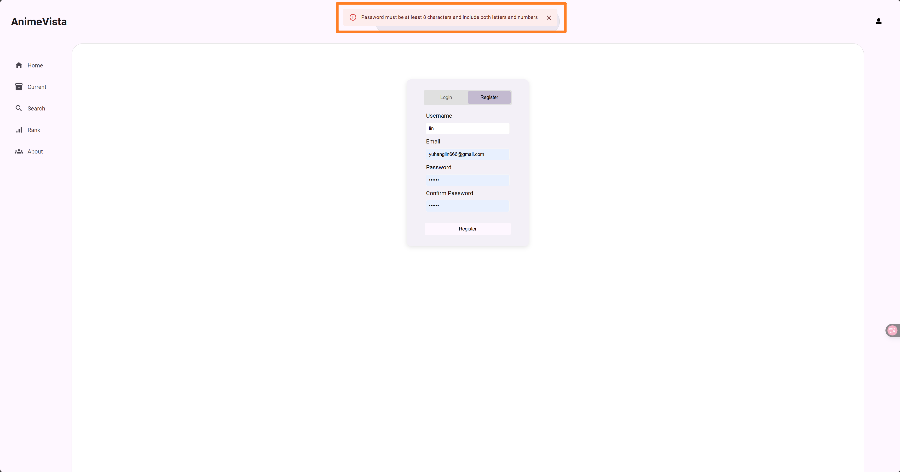
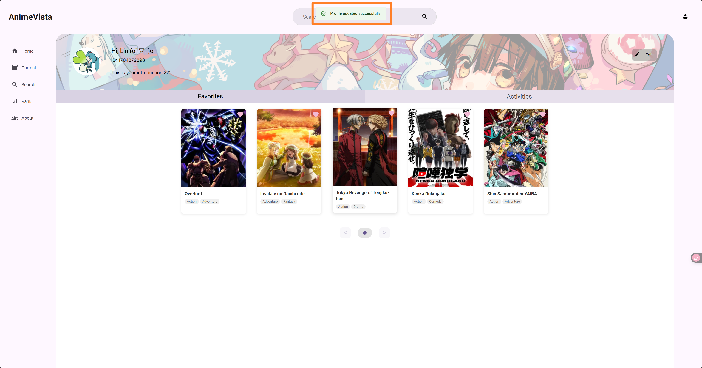

> 🌐 Chinese Version: [简体中文](./README.zh-CN.md)

# Anime Vista

## 🎬 Project Overview

Anime Vista is a single-page application (SPA) built with React, designed to provide users with a clear and immersive
guide to the current season's anime lineup. Focused on high availability and an exceptional user experience, the app
integrates core features such as anime recommendations, a timeline view, advanced filtering and search, rankings,
favorites, and detailed show information. It also supports user login and personalized interaction.

The project follows a Model-View-Presenter (MVP) architecture, utilizes Redux Toolkit for global state management, and
integrates Firebase for backend persistence and user authentication. The UI design was prototyped in Figma and strictly
adhered to throughout development for consistency.

This project also supports Server-Side Rendering (SSR), built using React Router's official framework-style
architecture. SSR improves initial page load performance and enhances SEO (Search Engine Optimization) friendliness. On
the first request, the server pre-renders the complete HTML content, reducing white screen time and making the
application more suitable for production deployment.

With Anime Vista, users can:

- Browse the seasonal anime lineup and view release schedules via a timeline
- Use multi-criteria filters to discover shows of interest
- Explore popularity rankings of trending titles
- Log in and manage a personalized favorites list
- Dive into detailed information for each anime, including characters and staff
- Rate and review anime, post social updates, and engage in community interactions
- And more...

This project serves both as a viewing companion for anime enthusiasts and as a comprehensive practice project for
frontend development, showcasing modern web architecture and development workflows.

## 🚀 Project Setup Instructions

After cloning the repository, run the following commands in the project root directory:

- `npm install`: Installs all project dependencies listed in [`package.json`](./package.json)
- `npm run dev`: Starts the local development server. You can view the project at `http://localhost:5173/`

If you see an error message like the one below in your console, it's because the project is running locally without the
SSR-related server started. This is expected behavior and does **NOT** affect the normal functionality of the project.
For other ways to run the project, please refer to the [dev-guide](docs/dev-guide/README.zh-CN.md) documentation.

```txt
Uncaught Error: Hydration failed because the server rendered HTML didn't match the client. As a result this tree will be regenerated on the client. This can happen if a SSR-ed Client Component used:

- A server/client branch `if (typeof window !== 'undefined')`.
- Variable input such as `Date.now()` or `Math.random()` which changes each time it's called.
- Date formatting in a user's locale which doesn't match the server.
- External changing data without sending a snapshot of it along with the HTML.
- Invalid HTML tag nesting.

It can also happen if the client has a browser extension installed which messes with the HTML before React loaded.

https://react.dev/link/hydration-mismatch
```

## 🖍️ Frontend Design

The frontend project design prototype is created
using [Figma](https://www.figma.com/design/LSyIJwZJsdOqOMlyL1aEfy/DH2642-Project?t=gBtJhullMivhXG3n-0).  
The link is privately maintained by the developers.

## 📚 Documentation

For more detailed designs and usage instructions, please refer to the documents in the [`docs/`](./docs) folder:

|                    Topic                    | Description                                                                                        |
|:-------------------------------------------:|:---------------------------------------------------------------------------------------------------|
| [architecture](docs/architecture/README.md) | Overview of project architecture, explanation of MVC/MVP, responsibilities of View/Presenter/Model |
|        [state](docs/state/README.md)        | Redux state structure, responsibilities and data structures of each slice                          |
|          [api](docs/api/README.md)          | Backend API introduction, communication, and Postman guidance                                      |
|     [firebase](docs/firebase/README.md)     | Firebase configuration: usage of auth and firestore                                                |
|      [routing](docs/routing/README.md)      | Page routing structure (React Router usage and paths of each page)                                 |
|    [dev-guide](docs/dev-guide/README.md)    | How to start the project, debugging, commit conventions, branching strategy, etc.                  |
| [contribution](docs/contribution/README.md) | Responsibilities and development of team member                                                    |

## 🛠️ Tech Stack

|         Category          | Choice                                 |
|:-------------------------:|:---------------------------------------|
|         Frontend          | React                                  |
|        SPA Routing        | React Router                           |
|   Server-Side Rendering   | React Router SSR + Express             |
|        State Mgmt         | Redux Toolkit                          |
|       Form Handling       | React Hook Form                        |
|        Persistence        | Firebase Firestore                     |
|      Authentication       | Firebase Authentication                |
|       API Requests        | Fetch API                              |
|         UI Design         | Figma                                  |
|        Deployment         | Firebase Hosting + Cloud Functions     |
| Cloud Runtime Environment | Google Cloud Run (invoked by Firebase) |

## Third-Party Component Library

This project uses the [Material UI](https://mui.com/material-ui/) component library for implementing some features. Selected examples are as follows:

1. Icon buttons used in the left sidebar and the user profile button in the top right corner
   

2. All top pop-up notifications, including alert-type and success-type pop-ups shown in the following two images:
   
   
