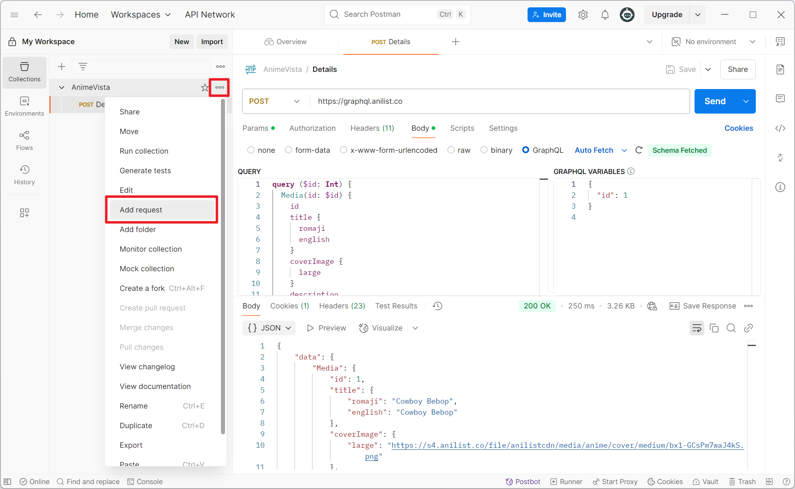
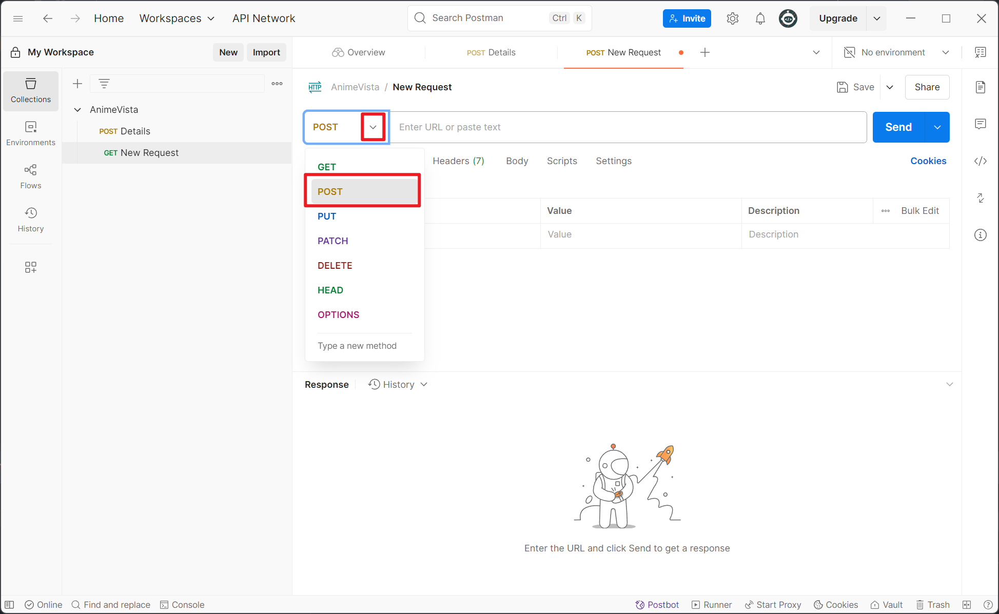
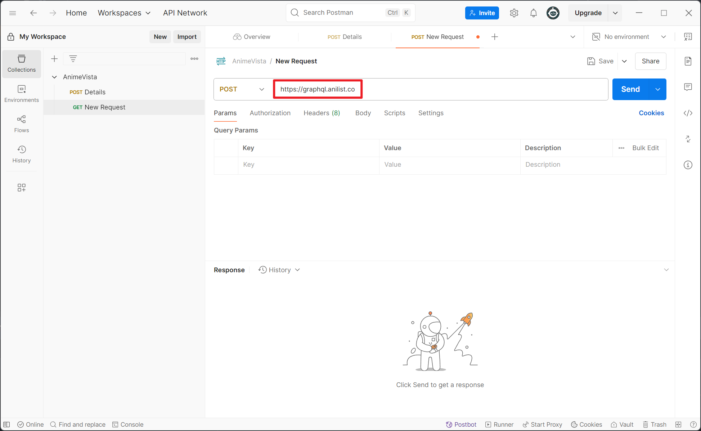
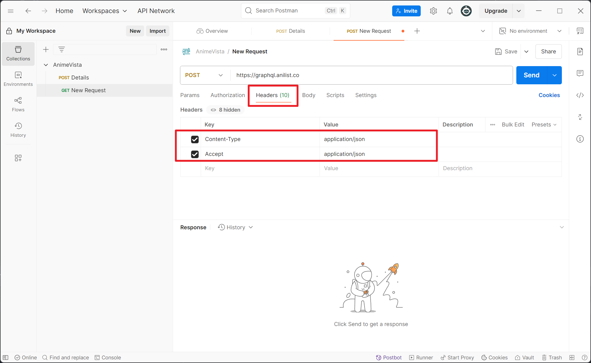
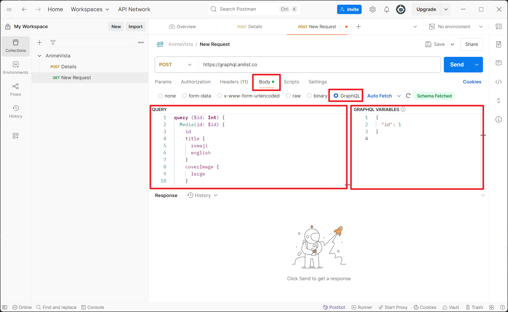
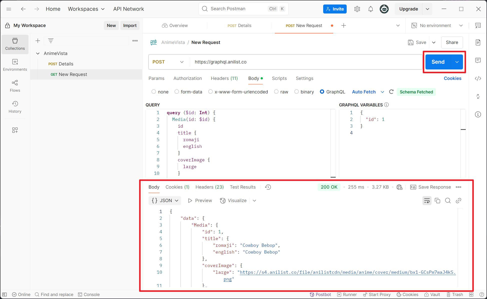

> 🌐 View in Chinese: [简体中文](./README.zh-CN.md)

# 📚 API Usage Guide

## 1. Introduction to Postman and Usage Recommendations

During development, it is recommended to use [Postman](https://www.postman.com/), a powerful API development and testing
tool for sending requests, viewing responses, debugging APIs, and managing request collections.

- [Postman Official Site](https://www.postman.com/)
- [Postman Download Page](https://www.postman.com/downloads/)

It is recommended to use Postman during development or debugging to quickly verify whether the API requests meet
expectations.

## 2. Types of API Communication

In this project, communication between the frontend and backend is mainly divided into two types:

- Public API: Uses data provided by the third-party service [AniList](https://anilist.co/), mainly for retrieving public
  information about anime, such as show details, rankings, search results, etc.
    - [AniList Official Guide](https://docs.anilist.co/guide/introduction)
    - [AniList API Reference](https://docs.anilist.co/reference/)

- Private API: A private API that communicates with the project group's Firestore database, used for retrieving
  user-related information such as favorites, activity, etc.

## 3. Public API

The AniList API uses the **GraphQL** protocol for communication. GraphQL is a flexible and efficient API query language
that allows the client to specify the required data structure, reducing unnecessary data transfer.
For more information, refer to the [GraphQL Official Documentation](https://graphql.org/learn/).

### 3.1 Basic Information of Public API

All requests should use the following settings:

- Request URL: `https://graphql.anilist.co`

- Request Method: `POST`

- Request Headers:

  ```json
  {
    "Content-Type": "application/json",
    "Accept": "application/json"
  }
  ```

- Request Body Format:

  ```json
  {
    "query": "...",
    "variables": { ... }
  }
  ```

  The `query` field is required, and the `variables` field is optional. See <a href='#title-3-3'>3.3</a> for details.

### 3.2 Postman Support for GraphQL Requests

Postman has built-in support for GraphQL, allowing direct entry of `query` and optional `variables` fields in the
request body.

<details>
<summary>Click to expand Postman tutorial</summary>

1. Open Postman and create a new request  
   

2. Set **Method** to `POST`  
   

3. Enter URL: `https://graphql.anilist.co`  
   

4. In the **Headers** tab, add the following headers:

    - `Content-Type`: `application/json`
    - `Accept`: `application/json`

   

5. In the **Body** tab, select **GraphQL** type and fill in the `QUERY` and `GRAPHQL VARIABLES` fields  
   

6. Click **Send** to send the request  
   

</details>

### <span name='title-3-3'> 3.3 Overview of Public API Usage in Pages </span>

The following describes the usage of public APIs in various pages, function descriptions, and corresponding GraphQL
`query` and `variables` examples:

- Current Season – List: fetch all anime as a list on current season
    <details>
    <summary>query</summary>

    ```
    query {
        Page(page: 1, perPage: 50) {
            media(season: SPRING, seasonYear: 2025, type: ANIME) {
                title {
                    romaji
                    english
                }
                coverImage {
                    large
                }
                trending
                startDate {
                    year
                    month
                    day
                }
            }
        }
    }
    ```
    </details>

    <details>
    <summary>variables</summary>

    ```
    {
        "page": 1,
        "perPage": 50
    }
    ```
    </details>


- Current Season – Timeline: fetch updating time of current season's animes
    <details>
    <summary>query</summary>

    ```graphql
    query {
        Page(page: 1, perPage: 50) {
            media(season: SPRING, seasonYear: 2025, type: ANIME) {
                title {
                    romaji
                }
                coverImage {
                    large
                }
                airingSchedule {
                    edges {
                        node {
                            id
                            airingAt
                            episode
                            mediaId
                            media {
                                title {
                                    romaji
                                }
                                episodes
                            }
                        }
                    }
                }
            }
        }
    }
    ```
    </details>

    <details>
    <summary>variables</summary>

    ```
    无
    ```
    </details>

    - Note: need to sort after fetch
    - demo: [testCurrentSeason.html](example/testCurrentSeason.html)

- Home: fetch popular anime on current time
    <details>
    <summary>query</summary>

    ```
    query {
        Page(page: 1, perPage: 50) {
            media(sort: TRENDING, type: ANIME) {
                id
                title {
                    romaji
                    english
                }
                coverImage {
                    large
                }
                description
                averageScore
                popularity
                startDate {
                    year
                    month
                    day
                }
                genres
            }
        }
    }
    ```
    </details>

    <details>
    <summary>variables</summary>

    ```
    无
    ```
    </details>


- Search：search anime based on user-defined conditions
    <details>
    <summary>query</summary>

    ```graphql
    query ($search: String, $genres: [String], $year: Int, $season: MediaSeason, $format: MediaFormat, $status: MediaStatus) {
        Page(page: 1, perPage: 10) {
            media(search: $search, genre_in: $genres, seasonYear: $year, season: $season, format: $format, status: $status) {
                id
                title {
                    romaji
                    english
                }
                genres
                season
                seasonYear
                status
                format
                popularity
                averageScore
                startDate {
                    year
                    month
                    day
                }
                coverImage {
                    large
                }
            }
        }
    }
    ```
    </details>

    <details>
    <summary>variables</summary>

    ```
    {
        "search": null,
        "genres": ["Action", "Drama"],
        "year": null,
        "season": "SPRING",
        "format": "TV",
        "status": "FINISHED"
    }
    ```
    </details>

    <details>
    <summary>Condition ranges</summary>

    1. **Genres**：
        - Action
        - Adventure
        - Comedy
        - Drama
        - Fantasy
        - Romance
        - Sci-Fi
        - Slice of Life
        - Others

    2. **Year**：
        - 2025
        - 2024
        - 2023
        - 2022
        - 2021
        - 2011-2020
        - 2000-2010
        - before 2000

    3. **Season**：
        - WINTER
        - SPRING
        - SUMMER
        - FALL

    4. **Format**：
        - TV（电视动画）
        - TV_SHORT（短篇电视动画）
        - MOVIE（电影）
        - SPECIAL（特别篇）
        - OVA（原创视频动画）
        - ONA（原创网络动画）
        - MUSIC（音乐动画）

    5. **Airing Status**：
        - FINISHED（已完结）
        - RELEASING（连载中）
        - NOT_YET_RELEASED（未发布）
        - CANCELLED（已取消）
        - HIATUS（暂停中）

    </details>

    - demo: [testSearch.html](example/testSearch.html)

- Rank ：按 Trending、Rating、Popularity 排序获取排行榜
    <details>
    <summary>query</summary>

    ```graphql
    query ($page: Int = 1, $sort: [MediaSort]) {
        Page(page: $page, perPage: 10) {
            media(type: ANIME, sort: $sort) {
                id
                title {
                    romaji
                    english
                }
                popularity
                averageScore
                startDate {
                    year
                    month
                    day
                }
                coverImage {
                    large
                }
            }
        }
    }
    ```
    </details>

    <details>
    <summary>variables</summary>

    ```json
    { "page": 1, "sort": ["TRENDING_DESC"] }
    ```

  Array contains only one element, must be one of these: `["TRENDING_DESC"]`、`["SCORE_DESC"]` 或 `["POPULARITY_DESC"]`
    </details>

    - demo: [testRank.html](example/testRank.html)

- Details: fetch details about an anime
    <details>

    <summary>query</summary>

    ```graphql
    query ($id: Int) {
        Media(id: $id) {
            id
            title {
                romaji
                english
            }
            coverImage {
                large
            }
            description
            genres
            averageScore
            meanScore
            popularity
            favourites
            status
            episodes
            duration
            format
            startDate {
                year
                month
                day
            }
            endDate {
                year
                month
                day
            }
            season
            studios(isMain: true) {
                nodes {
                    name
                }
            }
            characters(perPage: 10) {
                edges {
                    node {
                        id
                        name {
                            full
                        }
                        image {
                            large
                        }
                    }
                    role
                    voiceActors(language: JAPANESE) {
                        name {
                            full
                        }
                    }
                }
            }
            staff(perPage: 10) {
                edges {
                    node {
                        id
                        name {
                            full
                        }
                        image {
                            large
                        }
                    }
                    role
                }
            }
            relations {
                edges {
                    node {
                        id
                        title {
                            romaji
                            english
                        }
                        coverImage {
                            large
                        }
                        genres
                    }
                    relationType
                }
            }
        }
    }
    ```
    </details>

    <details>
    <summary>variables</summary>

    ```json
    { "id": 16498 }
    ```
    </details>

    - demo: [testDetails.html](example/testDetails.html)

## 4. CORS and Course Proxy Problem

We attempted to use the course proxy for AniList’s GraphQL API but confirmed (through testing and communication with the
course TA) that it does not support POST requests with JSON bodies — which are required by GraphQL. As a result, we have
to call the API directly from the frontend.

For normal usage, this works well. However, under rapid user interactions (such as quickly applying multiple filters),
we occasionally hit CORS errors or rate limits from the API. Since the AniList API has usage restrictions and CORS
headers we cannot control from a frontend-only app, the issue remains unresolved.

We discussed this with the TA but did not receive an effective workaround. The app is now deployed on Firebase and
functions correctly in most regular use cases, though the issue may still occur under heavy load.
